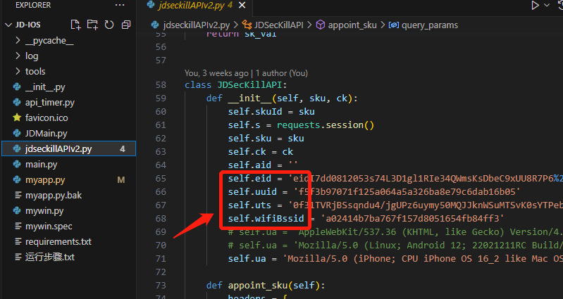
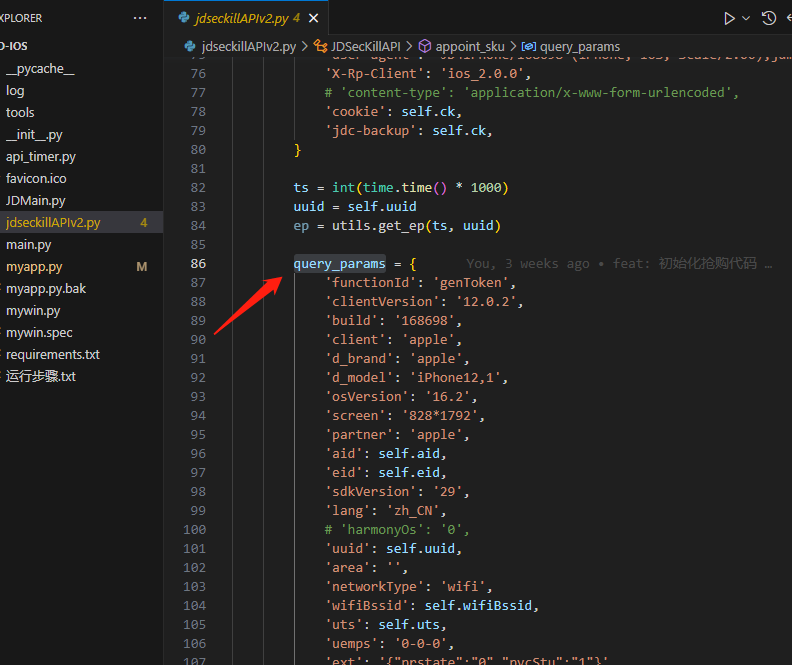

# 京东App秒杀抢购流程接口分析
反编译app  获取sign逻辑  模拟手机端接口请求；

秒杀一共分为两个步骤： 第一步是获取跳转链接，第二步是访问跳转链接。

第一步：获取跳转链接

跳转链接是指形如：https://un.m.jd.com/cgi-bin/app/appjmp 的链接，获取该链接，还需要一个前置步骤，即获取token和拼接url。先说获取token，获取token是通过genToken接口获取的，然后将获取到的tokenKey和url拼接起来，得到跳转链接。

第二步：访问跳转链接

拿到跳转链接后，直接将该跳转链接仍给浏览器即可，浏览器会经过两次302跳转得到sekill.action链接，从而渲染出提交订单页面，此时我们需要模拟点击“提交订单”按钮，实现抢购。（可以使用Selenium、Pyppeteer或Playwright等类库 来模拟浏览器）


此次基于原有的代码进行了修改，提高了抢购稳定性，IOS和安卓的是不同配置；
支持JD 茅台； 支持多开；

## 更新日期
2023/9/24
## 使用方法
### 1、抓包
主要是wskey中的cookie
### 2、修改配置参数


### 3、修改请求参数


### 4、启动运行
```python
  python myapp.py 
```


获取完整代码请联系： ZAZOCoder(微信) 

2023/08/01 近期sk有问题  代码暂不可用了！！

2023/08/13 问题修复

2023/09/01 增加消息推送

2023/09/18 优化抢购逻辑

2023/10/12 部分接口需要调整

个人稀土掘金页面：https://juejin.cn/user/553809592466200/posts


